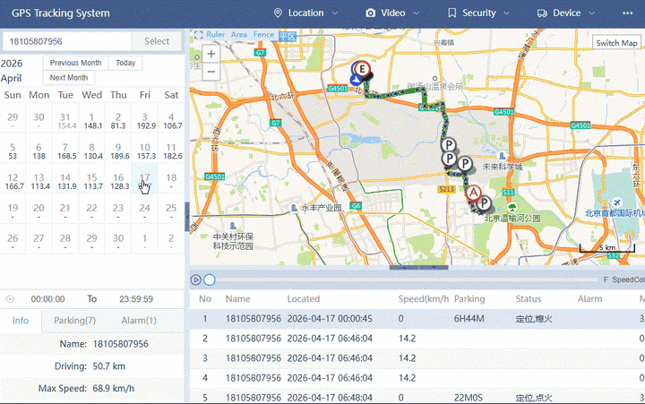
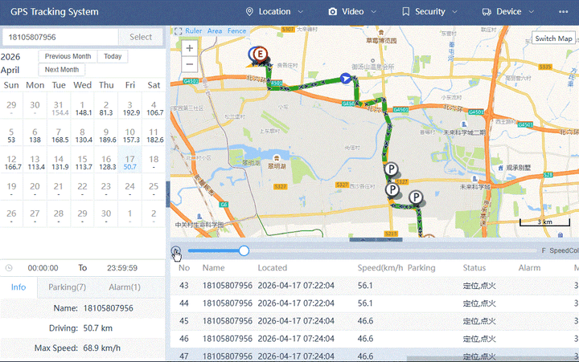
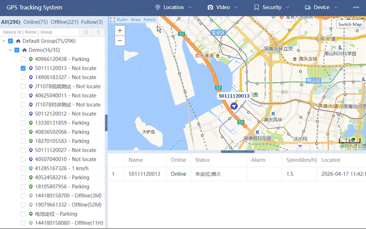
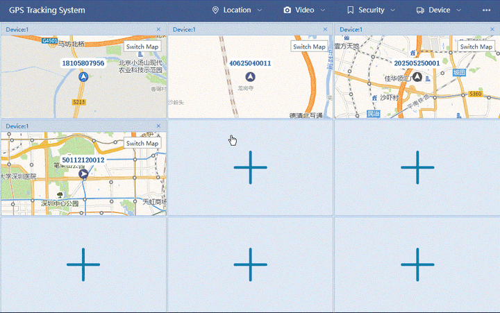
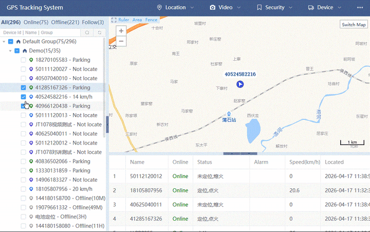

# 🚀 TracSeek（领新北斗） — Scalable JT808 Vehicle Tracking Platform


> - 🚗 Full support for the JT808 protocol (standard for vehicle terminal integration) 
> - ⚡ High-performance architecture design (scalable to large-scale device connectivity)  
> - 🛰 Real-time positioning / route tracking / geofencing 
> - 🧪 Built-in device simulator (testing without real hardware)  
>-  🌐 Visual monitoring platform  
> - 🔧 Suitable for logistics, fleet management, and IoT scenarios 

---

## 🎬 Demo

> 👇 See devices moving in real-time and trajectory playback







> 💡 Tip: Large GIF file — loading may take a moment.

---

## ✨ Why TracSeek?

Most JT808 projects only provide partial solutions. TracSeek gives you a **complete, runnable system**.

- 🧪 **Built-in device simulator** (test without real hardware)
- ⚡ **High-performance Netty-based architecture**
- 🌐 **Full-stack implementation** (server + simulator + UI)
- 🚀 **Designed for scalability** (massive device connections)
- 🛰 **Real-time tracking + trajectory playback + geofencing**

---

## ⚡ Quick Start (5 minutes)

> 🚀 Get the full system running locally in minutes

### 1. Clone repository

```bash
git clone https://github.com/lingxcom/tracseek.git
cd tracseek
git clone https://github.com/lingxcom/tracseek-web.git
```

### 2. Start with Docker

```bash
docker compose up -d
```

### 3. Open in browser

```bash
http://localhost:8800
Account:admin
Password:123456
```
---

### 🎉 What you'll see

- 🚗 Simulated devices automatically connected
- 📍 Real-time location updates
- 🛰 Trajectory playback
- 🚨 Alert events

👉 **No GPS device required — everything works out of the box**

---

## 🧪 Built-in Simulator (Key Feature)

Unlike most projects, TracSeek includes a **fully integrated simulator**:

- ✔ Simulate multiple devices
- ✔ Auto location reporting
- ✔ Alarm simulation
- ✔ Suitable for testing & load simulation

👉 This makes development and testing significantly easier

---

## 🧱 Architecture

```
Device / Simulator
        │
        ▼
JT808 Access Layer (Netty)
        │
        ▼
Business Processing
        │
        ▼
Data Storage
        │
        ▼
Visualization Platform
```

---

## 📊 Features

### 🚗 Vehicle Monitoring
- Real-time tracking
- Device status monitoring

### 🛰 Trajectory System
- Historical trajectory
- Route playback

### 🚨 Alert System
- Overspeed alerts
- Geofence alerts
- Abnormal behavior detection

### 📍 Visualization
- Multi-device display
- Dynamic map tracking

---

## 🎯 Use Cases

- 🚚 Fleet management systems
- 🚕 Ride-hailing platforms
- 🏭 Enterprise vehicle monitoring
- 🌍 IoT device access platforms
- 🎓 Learning JT808 protocol implementation

---

## 🆚 Comparison

| Feature | TracSeek | Typical Projects |
|--------|---------|----------------|
| Full JT808 Support | ✅ | ⚠️ |
| Built-in Simulator | ✅ | ❌ |
| One-click Deployment | ✅ | ⚠️ |
| Visualization UI | ✅ | ⚠️ |
| Complete End-to-End | ✅ | ❌ |

---

## 📦 Tech Stack

- Java
- Netty
- JT808 protocol implementation
- Frontend visualization system

---

## 📈 Roadmap

- [ ] JT1078 (video streaming support)
- [ ] Cluster / distributed deployment
- [ ] Multi-tenant support
- [ ] Enhanced permission system

---

## 🤝 Contributing

Contributions are welcome!

- Submit Issues
- Submit PRs
- Share ideas

---

## ⭐ Support the Project

If this project helps you:

👉 Please give it a **Star ⭐**

---

## 📬 Contact

283853318@qq.com


## Backend repository
* Gitee ：[https://gitee.com/lingxcom/tracseek](https://gitee.com/lingxcom/tracseek)
* Github ：[https://github.com/lingxcom/tracseek](https://github.com/lingxcom/tracseek)

## Frontend repository
* Gitee ：[https://gitee.com/lingxcom/tracseek-web](https://gitee.com/lingxcom/tracseek-web)
* Github ：[https://github.com/lingxcom/tracseek-web](https://github.com/lingxcom/tracseek-web)

## Download
* Gitee ：[https://gitee.com/lingxcom/tracseek/releases/download/1.1/tracseek.zip](https://gitee.com/lingxcom/tracseek/releases/download/1.1/tracseek.zip)
* Github ：[https://github.com/lingxcom/tracseek/releases/download/1.1/tracseek.zip](https://github.com/lingxcom/tracseek/releases/download/1.1/tracseek.zip)


## Terminal device simulation tool
* Gitee ：[https://gitee.com/lingxcom/jt808-client/releases/download/1.1/jt808tools-exe.zip](https://gitee.com/lingxcom/jt808-client/releases/download/1.1/jt808tools-exe.zip)
* Github ：[https://github.com/lingxcom/jt808-client/releases/download/1.1/JT808.zip](https://github.com/lingxcom/jt808-client/releases/download/1.1/JT808.zip)


## License
```
Apache License, Version 2.0

Licensed under the Apache License, Version 2.0 (the "License");
you may not use this file except in compliance with the License.
You may obtain a copy of the License at

    http://www.apache.org/licenses/LICENSE-2.0

Unless required by applicable law or agreed to in writing, software
distributed under the License is distributed on an "AS IS" BASIS,
WITHOUT WARRANTIES OR CONDITIONS OF ANY KIND, either express or implied.
See the License for the specific language governing permissions and
limitations under the License.
```
