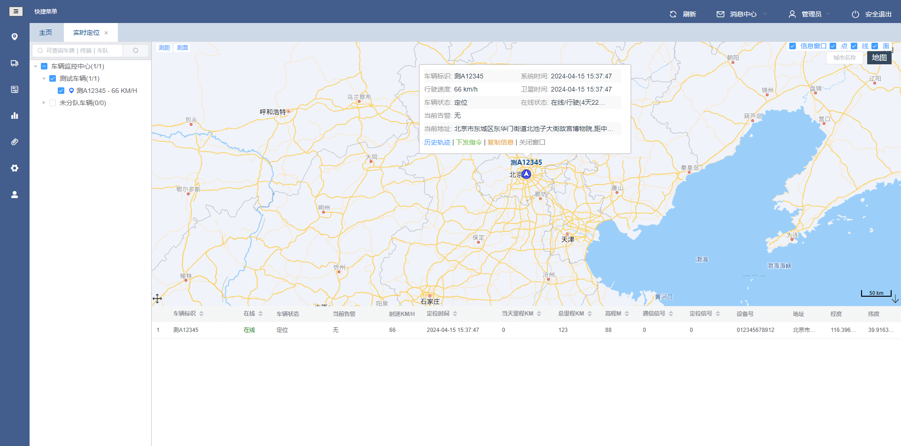
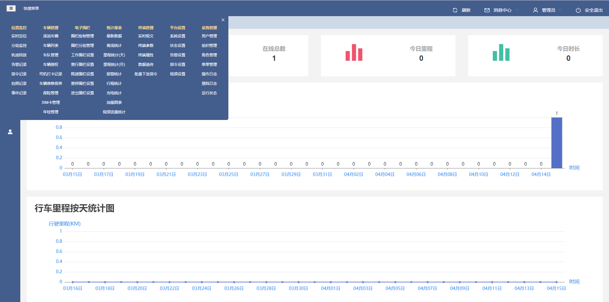
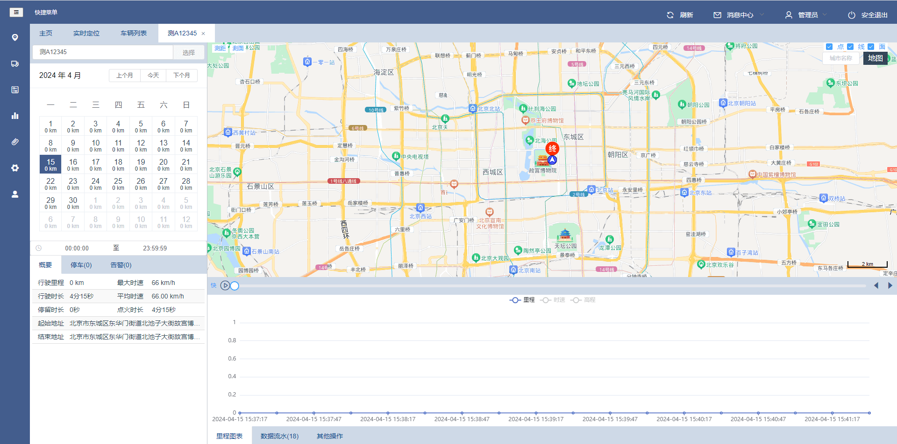
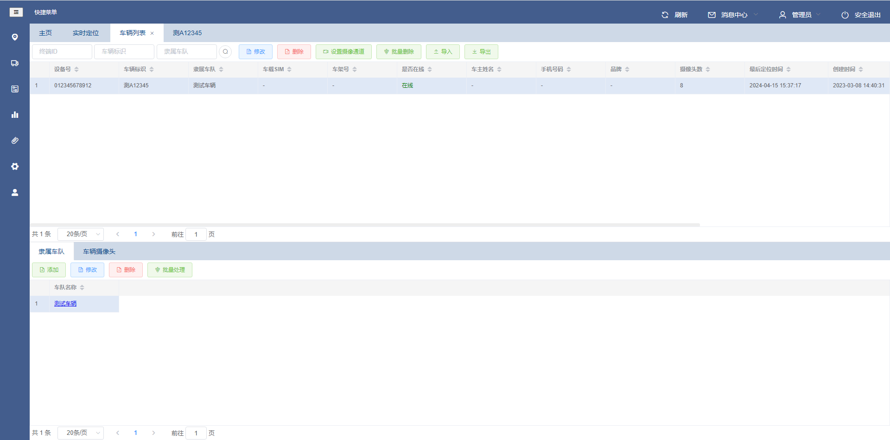
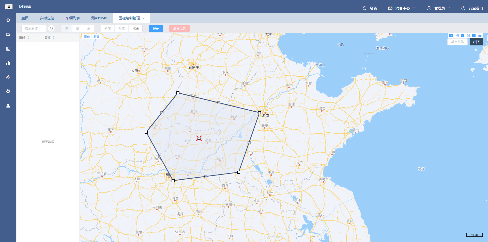
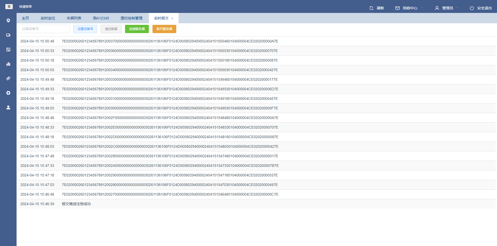

    
    
    

基于部标JT808标准实现的开箱即用的车载监控平台，负责实现核心信令与设备管理后台部分，支持海康、大华、锐明、通立等品牌的终端设备接入。

> 引入H2数据库原本是为了方便，不需要额外安装与配置MySQL，没想到带来是不便。所以另外创建仓库,数据库为MySQL8.0，提供GUI界面方便操作：https://gitee.com/lingxcom/tracbds

# 项目介绍
* 基于Netty4.1，实现JT808协议、JT1078协议、苏标、粤标、HTTP的消息处理。
* 提供绿色完整部署包，包含前后端数据库；下载即可运行的车辆定位管理系统。 [下载一键启动绿色版](https://gitee.com/lingxcom/jt808/releases/download/3.0.0/jt808.zip)

# 主要特性

* 高并发、高稳定性，8核16G单网关支持高达13.6万终端接入，连续压测3天以上。
* 支持分包粘包处理，避免漏包、丢包。保证数据的可靠性。
* 兼容2011、2013、2019协议版本，支持分包请求、分包应答及超时分包补传。
* 集成web界面，基于VUE2的Element UI开发的前端界面。
* 支持点、线、面多种电子围栏
* 支持在线报文抓取，方便分析终端上报的JT808原始报文。

# 协议支持
|协议名称|版本|是否支持| 备注           |
|---|---|---|--------------|
|JT/T 808|2011|支持|
|JT/T 808|2013|支持|
|JT/T 808|2019|支持|
|JT/T 1078|2016|支持| 需自建流媒体服务     |
|T/JSATL 12(主动安全-苏标)|2017|支持| 需自建流媒体服务附件服务 |

备注：
1078协议支持音视频指令，流媒体服务需自行搭建。
苏标主动安全全支持，附件服务器需自行搭建。

# 数据库H2
开源项目数据库是采用h2，免安装，随java自动启动。

# 代码仓库
* Gitee仓库地址：[https://gitee.com/lingxcom/jt808](https://gitee.com/lingxcom/jt808)
* Github仓库地址：[https://github.com/lingxcom/jt808](https://github.com/lingxcom/jt808)

# 免费版与商业版区别

| 功能模块 |免费版|商业版| 备注         |
|--|----|----|------------|
| 数据库 |H2|MYSQL8| -          |
| 协议扩展 |✔|✔| 已开源谷米GT6协议 |
| 实时定位 |✔|✔| -          |
| 历史轨迹 |✔|✔| -          |
| 指令下发 |✔|✔| -          |
| 参数设置 |✔|✔| -          |
| 在线抓包 |✔|✔| -          |
| 电子围栏 |✔|✔| -          |
| 车辆管理 |✔|✔| -          |
| 车队管理 |✔|✔| -          |
| 车队授权 |✔|✔| -          |
| JT808转发 |-|✔| -          |
| JT809协议 |-|✔| -          |
| 实时视频 |-|✔| -          |
| 历史视频 |-|✔| -          |
| 语音对讲 |-|✔| -          |
| 主动安全-ADAS |-|✔| -          |
| 主动安全-DSM |-|✔| -          |
| 主动安全-BSD |-|✔| -          |
| 主动安全-TPMS |-|✔| -          |
# 商业版-支持视频、语音、对讲、二次开发
安装包下载（包含安装说明）
https://pan.baidu.com/s/1zUx8qCiROYQc4G_HnjRquw?pwd=z22s

开放API说明
https://www.lingx.com/docs.html

商业版可以申请免费KEY（三个月时效）。
# 演示平台
演示地址

http://gps.lingx.com/

账号:admin

密码:123456

终端设备接入

IP：47.100.112.218

端口：8808

最新压测记录：https://blog.csdn.net/lingx_gps/article/details/136833506

