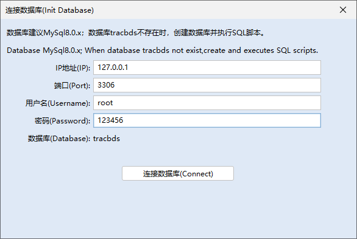
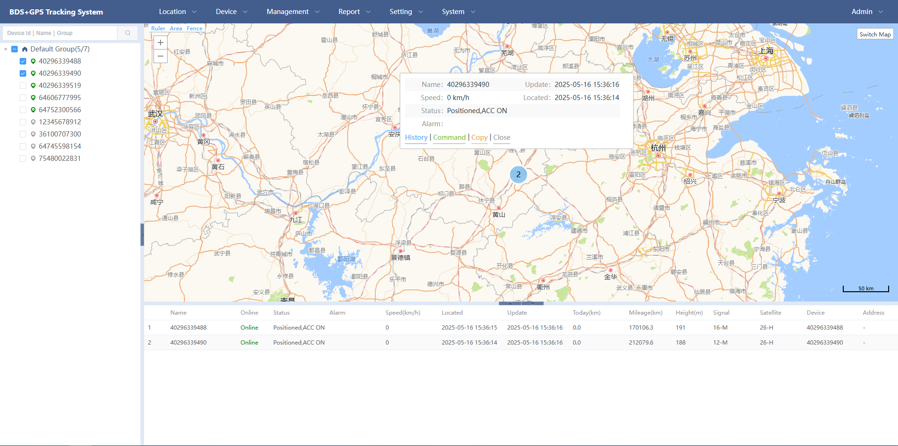
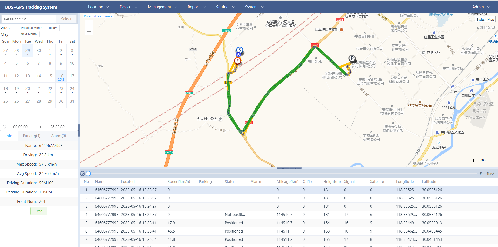
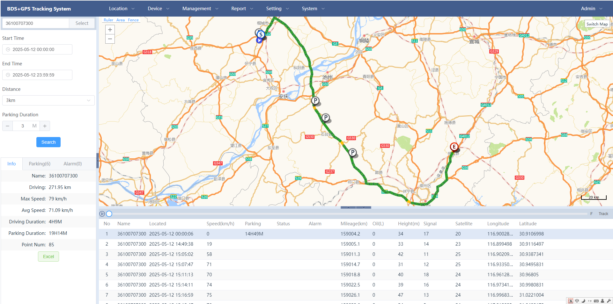

# [BDS+GPS Tracking System](https://www.lingx.com)


<p>
    
    
</p>

[中文说明](README_zh.md)

## Overview

BDS: BeiDou Navigation Satellite System.

GPS: Global Positioning System.

BDS+GPS Tracking System  is a location monitoring system based on the Chinese Ministry of Transport standard JT808 communication protocol, which can be extended to other communication protocols.

- [Terminal device simulation software](https://github.com/lingxcom/jt808-client)

## Demo

https://tracbds.lingx.com/


## Features

Some of the available features include:

- Real-time GPS tracking
- Detailed and summary reports
- Geofencing functionality
- Alarms and notifications
- Account and device management
- jt808-2013 and jt808-2019 support

## Getting Started
> Run in IDE: com.tracbds.server.AppUI
## TODO
 - JT1078-2016 Real time Video Monitoring

## Preview
- Software Startup Tool


- Database Configuration Tool



- Real-time GPS tracking



- Real-time GPS tracking Group

  

- History

  

- History(dilution)

  

- History(multiple)

  

## License
```
Copyright (C) 2021 magicxqq. All Rights Reserved.

Licensed under the Apache License, Version 2.0 (the "License");
you may not use this file except in compliance with the License.
You may obtain a copy of the License at

    http://www.apache.org/licenses/LICENSE-2.0

Unless required by applicable law or agreed to in writing, software
distributed under the License is distributed on an "AS IS" BASIS,
WITHOUT WARRANTIES OR CONDITIONS OF ANY KIND, either express or implied.
See the License for the specific language governing permissions and
limitations under the License.
```
