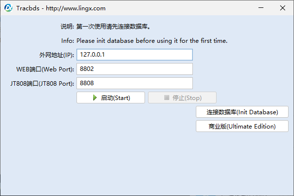
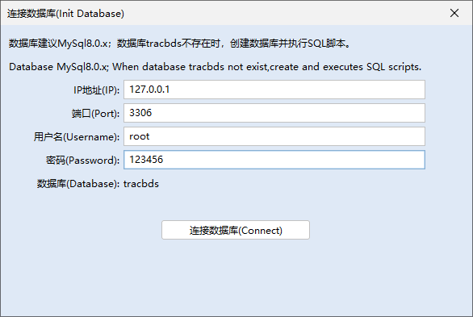
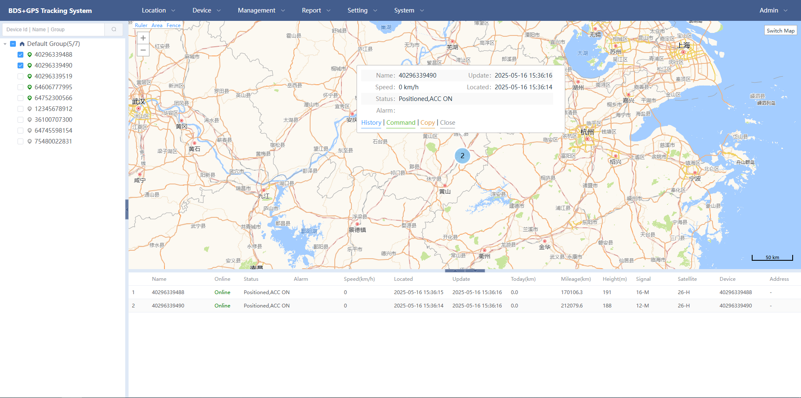
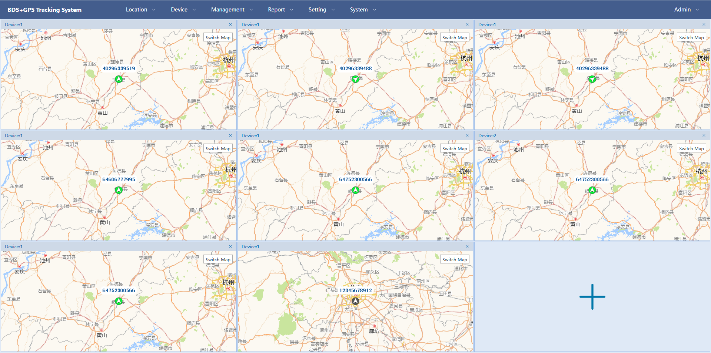
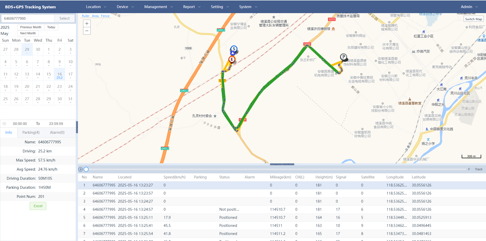
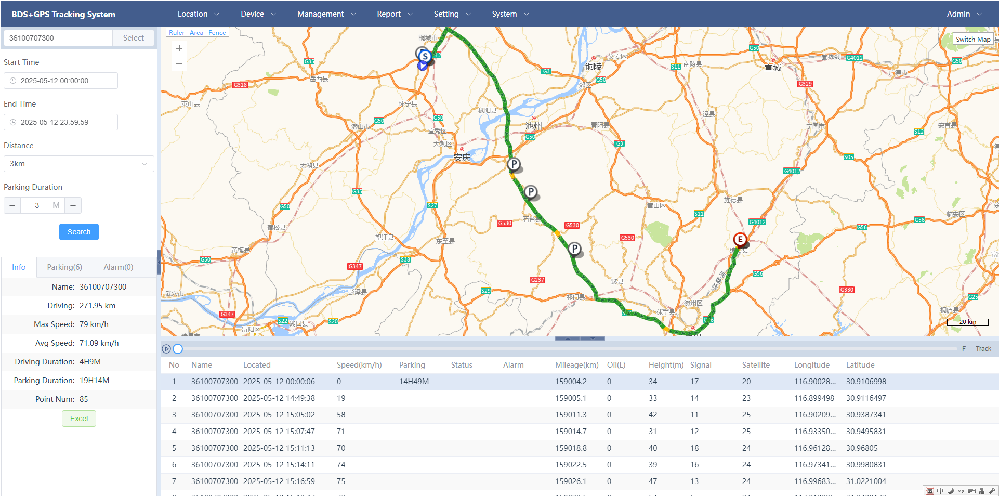
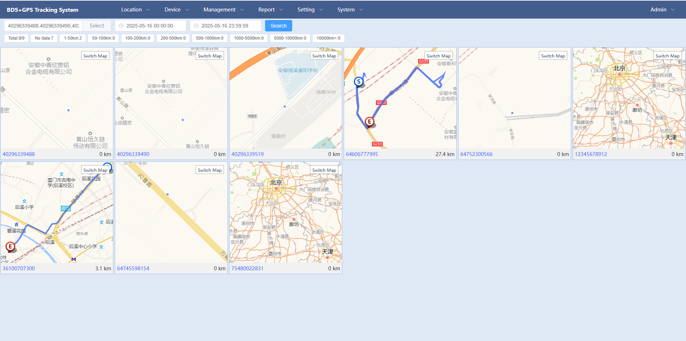

# 北斗GPS定位监控系统（BDS+GPS Tracking System）

BDS: BeiDou Navigation Satellite System.

<p>
    
    
    
</p>
基于部标JT808标准实现的开箱即用的北斗定位监控平台，负责实现核心信令与设备管理后台部分，支持海康、大华、锐明、通立、博实结等品牌的终端设备接入。


## 项目介绍
* 该项目是由商业版简化，保持了商业版的稳定性与可扩展性。
* 基于Netty4.1，实现JT808协议的上行消息与下行消息。
* 前端代码不开源，但已包含前端部署包。
* 提供绿色完整部署包，连接数据库便可使用。 [下载一键启动版](https://gitee.com/lingxcom/jt808/releases/download/1.0/tracbds-exe.zip)

## 主要特性
* 高并发、高稳定性，8核16G单网关支持高达13.6万终端接入，连续压测3天以上。
* 支持分包粘包处理，避免漏包、丢包。保证数据的可靠性。
* 兼容2011、2013、2019协议版本，支持分包请求、分包应答及超时分包补传。
* 集成web界面，基于VUE3的Element UI开发的前端界面。
* 支持多语言，目前支持中文与英文。

## 协议支持
| 协议名称                | 版本   | 免费版|商业版 | 备注           |
|---------------------|------|------|--------------|--------------|
| JT/T 808            | 2011 | 支持   | 支持   |
| JT/T 808            | 2013 | 支持   | 支持   |
| JT/T 808            | 2019 | 支持   | 支持   |
| JT/T 809            | 2011 | 未支持   | 支持   |
| JT/T 1078           | 2016 | 未支持  |  支持   |
| T/JSATL 12(主动安全-苏标) | 2017 | 未支持  | 支持   |


## 数据库MySQL8.0
数据库是采用MySQL8.0，下载地址：https://www.mysql.com/downloads/

## 代码仓库
* Gitee仓库地址：[https://gitee.com/lingxcom/jt808](https://gitee.com/lingxcom/jt808)
* Github仓库地址：[https://github.com/lingxcom/jt808](https://github.com/lingxcom/jt808)

## 免费版与商业版区别

| 功能模块 |免费版|商业版| 备注         |
|--|----|----|------------|
| 数据库 |MYSQL8|MYSQL8| -          |
| 协议扩展 |✔|✔|  |
| 实时定位 |✔|✔| -          |
| 历史轨迹 |✔|✔| -          |
| 指令下发 |✔|✔| -          |
| 参数设置 |✔|✔| -          |
| 在线抓包 |✔|✔| -          |
| 电子围栏 |✔|✔| -          |
| 车辆管理 |✔|✔| -          |
| 车队管理 |✔|✔| -          |
| 车队授权 |✔|✔| -          |
| JT808转发 |-|✔| -          |
| JT809协议 |-|✔| -          |
| 实时视频 |-|✔| -          |
| 历史视频 |-|✔| -          |
| 语音对讲 |-|✔| -          |
| 主动安全-ADAS |-|✔| -          |
| 主动安全-DSM |-|✔| -          |
| 主动安全-BSD |-|✔| -          |
| 主动安全-TPMS |-|✔| -          |

## 商业版演示地址
http://gps.lingx.com/

账号:admin

密码:123456

终端设备接入

IP：47.100.112.218

端口：8808

最新压测记录：https://blog.csdn.net/lingx_gps/article/details/136833506

## 开源版演示地址

https://tracbds.lingx.com

## 功能展示
- Software Startup Tool



- Database Configuration Tool



- Real-time GPS tracking



- Real-time GPS tracking Group

  

- History

  

- History(dilution)

  

- History(multiple)

  

## License
```
Apache License, Version 2.0

Licensed under the Apache License, Version 2.0 (the "License");
you may not use this file except in compliance with the License.
You may obtain a copy of the License at

    http://www.apache.org/licenses/LICENSE-2.0

Unless required by applicable law or agreed to in writing, software
distributed under the License is distributed on an "AS IS" BASIS,
WITHOUT WARRANTIES OR CONDITIONS OF ANY KIND, either express or implied.
See the License for the specific language governing permissions and
limitations under the License.
```